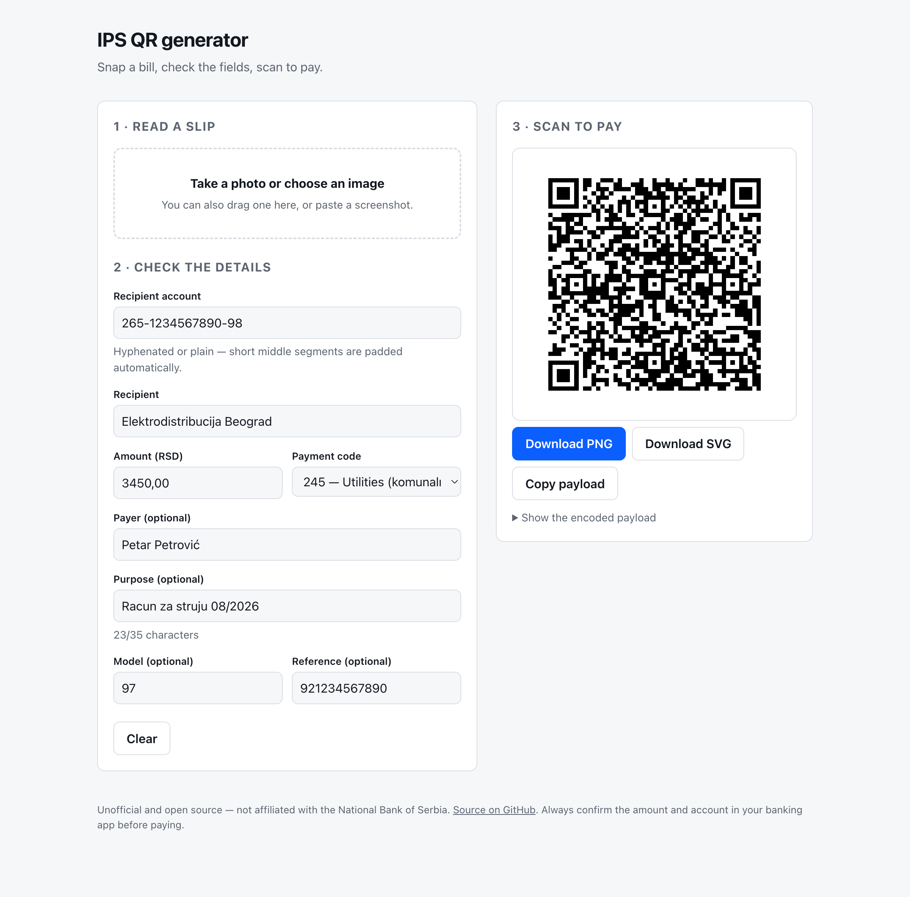

<h1 align="center">Payment to QR</h1>

<p align="center">
  <strong>AI-compatible NBS IPS QR code generator — photograph a Serbian payment slip, get a code you can pay from any banking app.</strong>
  <br>
  <sub>Generator IPS QR koda &middot; uplatnica u QR kod &middot; besplatno i otvorenog koda</sub>
</p>

<p align="center">
  <a href="https://github.com/Vujavujavuja/Payment-to-QR/actions/workflows/ci.yml"></a>
  <a href="LICENSE"></a>
  
  
  <a href="CONTRIBUTING.md"></a>
</p>

<p align="center">
  <picture>
    <source media="(prefers-color-scheme: dark)" srcset="docs/screenshot-dark.png">
    
  </picture>
</p>

> **Unofficial project.** Not affiliated with or endorsed by the National Bank of Serbia.
> Always confirm the amount and recipient account in your banking app before paying.

---

## The idea

```
image ──▶ extractor ──▶ editable form ──▶ validation ──▶ QR code
          (OCR or         (you check      (mod 97-10,
           Claude)         the fields)     field limits)
```

**The middle step is not skippable, by design.** Extraction is best effort: OCR
misreads digits and vision models transcribe a `7` as a `1`. Every field the
extractor was unsure about is flagged for review, and **no QR is rendered until
the payment passes validation** — including the account's mod 97-10 control
digits.

A wrong digit here sends money to a stranger. That constraint shapes everything
else in this repository.

## Quick start

```bash
npm install
npm run dev
```

Open <http://localhost:3000>. No configuration, no API key. OCR runs in your
browser and the image never leaves your device.

<details>
<summary><strong>Optional: Claude vision extraction</strong></summary>

On-device OCR struggles with angled photos, handwriting, and low light. For a
more capable extractor:

```bash
cp .env.example .env
# add your key to ANTHROPIC_API_KEY
```

The option only appears in the UI once the server confirms a key is configured.

Note the tradeoff: this **sends the image to Anthropic**, and a payment slip
usually carries a name, an address, and an account number. It is opt-in for
that reason, and the key stays server-side — it is never shipped to the browser.

⚠️ **`/api/extract` costs you money per request.** It is rate limited — 10 per
caller per hour and 100 overall by default, tunable with `EXTRACT_RATE_LIMIT`,
`EXTRACT_RATE_LIMIT_GLOBAL` and `EXTRACT_RATE_WINDOW_MS`.

Treat that as a courtesy limit, not a security boundary: the caller's address
comes from a client-supplied header, and the counters live in process memory,
so a host running several instances gives each its own. If you deploy publicly
with a key configured, set the global limit to a number you would not mind
paying, and reach for a shared store if you need a real guarantee.

</details>

## Install it on a phone

It is a progressive web app. Open it in a browser and use **Add to Home Screen**
(Safari) or **Install app** (Chrome). It then launches in its own window with no
browser chrome, which matters when you are holding a bill in the other hand.

### What works with no connection

| | Offline |
| --- | --- |
| Typing a payment in and generating a QR code | Always |
| Downloading the code as PNG or SVG | Always |
| Reading a slip with on-device OCR | After one scan made while online |
| Claude vision extraction | Never — it is a server call by definition |

Encoding, validation and QR rendering are pure client-side code, so the first
row needs no network at any point. The second needs one online scan first,
because that is when the Serbian and English language data is downloaded and
cached.

Nothing is downloaded speculatively: install the app and it costs you the page.
The tens of megabytes of language data arrive only if you actually scan
something.

## Two implementations

The same specification, twice, with test suites that mirror each other.

| | TypeScript | Python |
| --- | --- | --- |
| Library | `src/core` | `python/ips_qr` |
| Extraction | `src/extract` | `python/ips_qr/extract` |
| Interface | Web app (Next.js) | `ips-qr` CLI |
| Input | Camera, file, paste | Text, PDF, stdin |
| Tests | 35 | 71 |

The Python port currently fixes three bugs the TypeScript still has — see
[#2](https://github.com/Vujavujavuja/Payment-to-QR/issues/2). Divergence is
tracked, not accidental.

### TypeScript

```ts
import { encodePayment, validatePayment } from '@/core';

const payment = {
  recipientAccount: '265-1234567890-98', // padded and checksummed for you
  recipientName: 'Elektrodistribucija Beograd',
  amount: '3450.00',
  paymentCode: '189',
};

const { valid } = validatePayment(payment);
if (valid) console.log(encodePayment(payment).payload);
```

### Python

```bash
cd python && pip install -e ".[dev]"
ips-qr --pdf racun.pdf --payment-code 253 --png qr.png
```

```python
from ips_qr import IpsPayment, encode_payment, validate_payment

payment = IpsPayment(
    recipient_account="265-1234567890-98",
    recipient_name="Elektrodistribucija Beograd",
    amount="3450,00",              # Serbian or English separators
    payment_code="189",
)

if validate_payment(payment).valid:
    print(encode_payment(payment).payload)
```

`validatePayment` / `validate_payment` separates **errors** (the payload would
be wrong or unusable) from **warnings** (suspicious but still encodable — you
may know something the library does not).

## The payload format

An IPS QR code is a flat, pipe-separated string:

```
K:PR|V:01|C:1|R:265000123456789098|N:Elektrodistribucija Beograd|I:RSD3450,00|SF:189|S:Racun za struju|RO:97921234567890
```

| Tag | Field | Required | Max |
| --- | --- | --- | --- |
| `K` | Identification code — always `PR` | yes | 2 |
| `V` | Version — always `01` | yes | 2 |
| `C` | Character set — `1` for UTF-8 | yes | 1 |
| `R` | Recipient account, 18 digits | yes | 18 |
| `N` | Recipient name | yes | 70 |
| `I` | Amount, e.g. `RSD3450,00` | yes | 20 |
| `P` | Payer name | no | 70 |
| `SF` | Payment code, 3 digits | yes | 3 |
| `S` | Purpose of payment | no | 35 |
| `RO` | 2-digit model + reference number | no | 2 + 22 |

Optional tags are omitted entirely rather than emitted empty.

### Things that are easy to get wrong

Each of these is a real bug that this code has had, or deliberately avoids.

- **Account padding.** Slips print `265-1234567890-98`. The middle segment is
  10 digits and must be left-padded to 13 — stripping the hyphens gives you 16
  characters, and padding the wrong end gives you a *different, valid-looking*
  account.
- **Decimal separators.** `1.234,56` (Serbian) and `1,234.56` (English) both
  appear, sometimes in one document. The libraries disambiguate by separator
  position rather than assuming a locale.
- **Control digits.** An 18-digit account exceeds `Number.MAX_SAFE_INTEGER`, so
  the mod 97-10 check must use `BigInt`. In floating point it silently accepts
  invalid accounts.
- **Script folding is not length-preserving.** Serbian `ђ љ њ џ` each fold to
  two Latin characters, so an offset into the folded text is not an offset into
  the original. `БУЏЕТ` is enough to misplace every field after it.
- **Dates look like amounts.** `30.04.2027` parses to a very confident
  `30042027.00` unless date-shaped tokens are excluded.
- **Labels have false friends.** `korisnik` is the payee on a bank slip and the
  driver on a police summons.

## Project layout

```
src/
  core/          IPS spec: types, validation, encode, parse, QR rendering
  extract/       Provider interface, Tesseract and Claude implementations
  app/           Next.js App Router pages and the /api/extract route
  components/    Dropzone, form, QR preview
python/
  ips_qr/        The port: core, extraction, PDF backend, CLI
  tests/         71 tests, including a render-and-decode round trip
```

## Questions

<details>
<summary><strong>What is an NBS IPS QR code?</strong></summary>

The QR code standard defined by the National Bank of Serbia (Narodna banka
Srbije) for instant payments. Scanning one in a Serbian banking app fills in
the recipient account, amount, payment code and reference automatically. The
code itself is a flat pipe-separated string of tagged fields.

</details>

<details>
<summary><strong>Does this move money or make a payment?</strong></summary>

No. It only encodes payment instructions into a QR code. Nothing is
transferred, no bank connection exists, and no account credentials are ever
requested. Your banking app performs the payment after you review and confirm
it there.

</details>

<details>
<summary><strong>Is it free, and does my document leave my device?</strong></summary>

Free and open source under the MIT licence. The default extractor runs OCR in
your browser, so the image never leaves your device. The optional Claude vision
extractor is more accurate but sends the image to a server, which is why it is
opt-in and off by default.

</details>

<details>
<summary><strong>Why do I have to check the fields myself?</strong></summary>

Because extraction is unreliable by nature — OCR misreads digits and vision
models transcribe a `7` as a `1`. A wrong digit sends money to a stranger.
Fields the extractor was unsure about are flagged, and no QR code is rendered
until the payment validates, including the account control digits.

</details>

<details>
<summary><strong>Does it work offline?</strong></summary>

Typing a payment in and generating a QR code works with no connection at all —
the encoding and rendering happen on your device. Reading a slip with OCR works
offline too, but only after one scan made while online, which is when the
language data is downloaded. The optional Claude extractor always needs a
connection.

</details>

<details>
<summary><strong>Is this an official National Bank of Serbia application?</strong></summary>

No. It is unofficial and independent, not affiliated with or endorsed by the
National Bank of Serbia. Always confirm the amount and recipient account in
your banking app before paying.

</details>

## Ukratko na srpskom

**Payment to QR** pretvara uplatnicu, račun ili fakturu u **IPS QR kod** koji
možete skenirati u bilo kojoj srpskoj bankarskoj aplikaciji.

Slikajte uplatnicu, proverite podatke koje je program pročitao, i dobijate QR
kod za plaćanje. Tekst se čita **na vašem uređaju** — slika ne napušta telefon
osim ako sami ne uključite Claude ekstraktor.

Program **ne vrši plaćanje** i ne traži pristup vašem računu. Broj računa se
proverava kontrolnim ciframa (mod 97-10), a QR kod se ne generiše dok podaci
nisu ispravni. Podržana su oba pisma, ćirilica i latinica.

Aplikaciju možete **instalirati na telefon** (Dodaj na početni ekran). Unos
podataka i generisanje QR koda rade **i bez interneta**. Čitanje uplatnice bez
interneta radi nakon prvog skeniranja sa vezom, kada se preuzmu jezički podaci.

Projekat je nezvaničan i nije povezan sa Narodnom bankom Srbije. Uvek proverite
iznos i broj računa u svojoj banci pre plaćanja.

## Contributing

Issues and pull requests are welcome — start with
[CONTRIBUTING.md](CONTRIBUTING.md), or the
[good first issues](https://github.com/Vujavujavuja/Payment-to-QR/issues?q=is%3Aissue+is%3Aopen+label%3A%22good+first+issue%22).

**The most useful contribution needs no code:** a document that extracts badly.
Real layouts vary far more than any fixture, and every one added so far has
found a bug. Use the *Document extracts badly* issue template.

⚠️ **Never post an unredacted payment document.** They carry account numbers,
names and addresses — yours or someone else's — and a public issue is permanent
and indexed. Retype the values as placeholders; do not blur. CONTRIBUTING.md
explains how.

## Known limitations

- OCR accuracy on photographed slips is mediocre. This is why the form exists.
- Model 97 reference validation is warning-only, and abstains on non-numeric
  references — some issuers use letters.
- Generated codes are not verified against the official NBS validator
  ([#4](https://github.com/Vujavujavuja/Payment-to-QR/issues/4)).
- The interface is English only
  ([#3](https://github.com/Vujavujavuja/Payment-to-QR/issues/3)).

## Security

To report a vulnerability, email **nemanja@vujic.ai** rather than opening an
issue. See [SECURITY.md](SECURITY.md) — it explains what counts as a
vulnerability here, which is narrower and more specific than it sounds.

## Licence

MIT — see [LICENSE](LICENSE).
